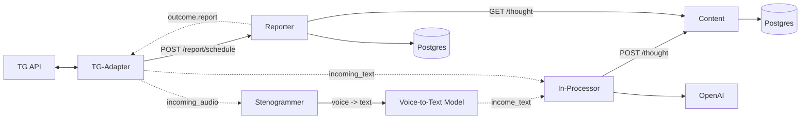

# Application architecture

# Git workflow

## Branches
- `main` — stable
- `dev` — integration branch

## Rules
1. Create a branch from `dev`
2. Open PRs into `dev`
3. When ready, merge `dev` → `main`

## Branch naming
- `feat/<short-name>`
- `fix/<short-name>`
- `docs/<short-name>`
- `chore/<short-name>`

## Commit message style

Format:
`<type>: <short summary>`

Types:
- `feat` — feature
- `fix` — bug fix
- `docs` — docs only
- `chore` — tooling/ci/deps

Examples:
- `feat: add voice note support`
- `fix: handle empty diary entry`
- `docs: add architecture diagram`
- `chore: add lint and tests`

